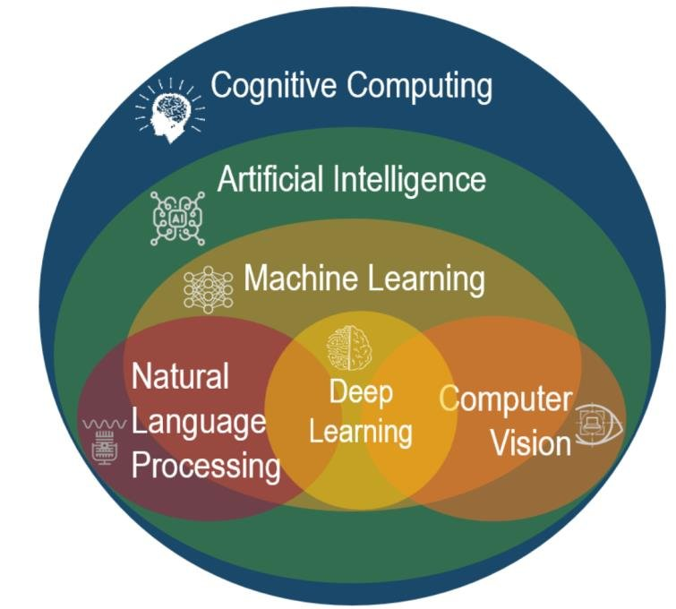

## UCS712 Cognitive Computing

> **"Cognitive Computing is not just about teaching machines to think; it's about unlocking the potential of human-machine collaboration to solve problems we once thought impossible."**

With God's blessings and guidance, we embark on our journey into the world of Cognitive Computing, excited to explore the possibilities of intelligent systems that can think, learn, and make decisions. This course introduces us to the fascinating realms of artificial intelligence, machine learning, and natural language processing, providing a foundation to understand how these transformative technologies can solve real-world problems and drive innovation across industries. Guided by our esteemed instructor, whose expertise and passion inspire us, we look forward to gaining both technical proficiency and practical insights. This course promises to be more than a learning experience—it's a stepping stone toward reimagining the future with intelligent systems.

Smarth Kaushal  
Jan 10, 2025

